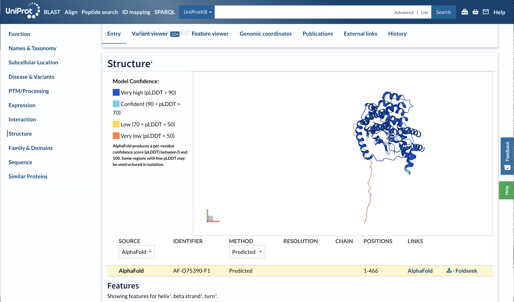
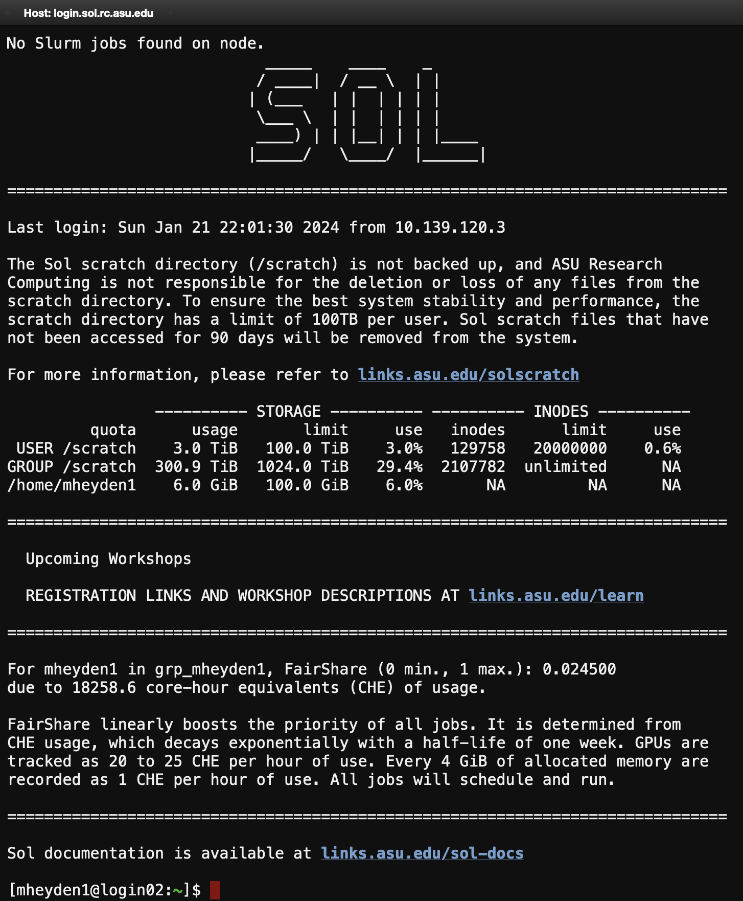

# Homework 4 Part 1 #
Special thanks to Josh Vermaas (Michigan State University) who prepared a previous version of this tutorial!

What AlphaFold and similar tools do is combine information from structural and sequence databases to predict protein structures.
The main goals for this exercise are:
- Get to know some of the protein structure prediction webservers
- Learn how to use local high performance computing resources to predict more complicated protein structures

## Do I need to run AlphaFold at all? ##

DeepMind, the Google division that developed AlphaFold, has run the prediction software on many proteins already!
These are often available on [Uniprot](https://www.uniprot.org/).
For instance, in addition to the many experimentally solved structures for citrate synthase (enzyme that catalyzes first reaction in Krebs cycle), the [Uniprot entry for citrate synthase](https://www.uniprot.org/uniprotkb/O75390/entry) (see section structure) also has the structure predicted by available for download.



DeepMind has already [predicted the structure for almost all proteins in humans and in multiple model organisms](https://www.deepmind.com/blog/alphafold-reveals-the-structure-of-the-protein-universe), and made these available to the public through the [AlphaFold Protein Structure Database](https://alphafold.ebi.ac.uk/).

## Webservers! ##

If you really just want an answer for a protein structure *right away*, the easiest thing to do is to run AlphaFold or another protein structure prediction tool within a webserver.
In this scenario, you will upload one or multiple protein sequences of interest to a website, which will use computing resources provided by someone else to predict the protein structure.
A popular webserver for protein prediction is [ColabFold](https://github.com/sokrypton/ColabFold), which provides an easy-to-use interface to do AlphaFold-like things, since it implements everything as a Jupyter notebook and is quite interactive.
ColabFold's claim to fame is that it has a cheaper way of doing the initial multiple sequence alignments (MSA) and homology searches, which are described in the [companion paper to the webserver](https://doi.org/10.1038%2Fs41592-022-01488-1).

There are other webservers too.
Protein structure prediction is a rapidly evolving field where multiple groups have their own ideas as to how they should take the ideas that AlphaFold pioneered and make them work better, or take less compute time.
The competitors include tech giants like Meta who developed a neural network called ESMFold to [predict protein structures](https://esmatlas.com/), which was published in [_Science_ in 2023](https://doi.org/10.1126/science.ade2574).
Other, more classical approaches, such as I-TASSER, were the best options before machine learning and AI methods for protein structure prediction became widespread.
The corresponding [webserver still exists](https://zhanggroup.org/I-TASSER/) and provides a window into the pre-AlphaFold universe of protein structure prediction.

Just so we get a sense of how these webservers work, we will try some of them here.
Here is a short peptide sequence that contains some protein secondary structure, a helix and a few beta sheets.
```
PIAQIHILEGRSDEQKETLIREVSEAISRSLDAPLTSVRVIITEMAKGHFGIGGELASK
```
Lets copy that amino acid sequence and use it as an input for the following webservers:

- [ESMFold](https://esmatlas.com/resources?action=fold) by Meta
- [ColabFold](https://colab.research.google.com/github/sokrypton/ColabFold/blob/main/AlphaFold2.ipynb) from Seoul National University in South Korea
- [RoseTTAFold](https://robetta.bakerlab.org) from the Baker lab a University of Washington Washington (requires making an account)
- [D-I-Tasser](https://zhanggroup.org/D-I-TASSER/) by the Zhang group at the University of Michigan
- [TopModel](https://cpclab.uni-duesseldorf.de/topsuite/topmodel.php), developed by the [Gohlke group at the University of Duesseldorf in Germany](https://doi.org/10.1021/acs.jcim.0c01202)

Questions to consider as you are going through the webservers:

1. How fast is the webserver at returning a result? (if one of them takes longer than 24 hours, you can ignore it)
2. In entering the sequence, is it obvious if the method can predict protein complexes?
3. Do the output structures look similar to one another?
4. How would you save the output structure to your own computer for further analysis?

Be warned, some of these webservers are relatively slow, so keep the tab open in the background as you work through the list.
*Save the structure files (pdb) to your own computer! You'll need to analyze them later!*

## Running AlphaFold2 Yourself! ##

Now lets pretend that you cannot use a webserver.
Maybe your protein is too complicated to solve on the computing resources folks will give away for free, or you are working in a setting where the protein sequence is a trade secret that you cannot disclose to a webserver.
What do you do then?
The model for AlphaFold2 has been released to the public, and is available for download on [github](https://github.com/google-deepmind/alphafold).
Take a minute to read through the instructions.
We won't be following them, since we already have a working version of AlphaFold2 available on SOL.
But, if you wanted to install AlphaFold2 on your own computer, you can!

To access SOL, we will again use the web interface provided by ASU's Research Computing core facility, which you can find here: [sol.asu.edu](sol.asu.edu).

To run AlphaFold2 on SOL, we will again use the text-based interface called terminal or shell, which you already used in Homework 2 to receive the files for the linear and non-linear regression exercise. 

Once you see this screen:


click on `System` --> `>_Sol Shell Access to start your terminal session:



Now use the following set of commands to copy the files you need for this exercise:

Enter the previously created `CHM501` directory in your home directory on SOL:
```bash
cd CHM501
```
Then copy the files you need for this exercise (don't forget the full stop `.`):
```bash
cp -r /scratch/mheyden1/CHM501/HW4 .
```
Then enter the `HW4` directory:
```bash
cd HW4
```
To see the contenct of the `HW4` directory, type:
```bash
ls
```
Each of three folders contains one usage example for a full protein structure prediction with AlphaFold2. This includes multiple sequence alignment and homology template generation (largely disabled in Example-2) as well as running the full AlphaFold2 network with all of its features.

These examples will provide you with a guide on how to run AlphaFold2 protein predictions, e.g., for your research projects.
- [Example 1](Example-1) is for the same single domain protein we have been using for the webservers, which folds into secondary structure that is well established.
- [Example 2](Example-2) will use AlphaFold to predict the structure for a protein that was recently solved, and is available from the [Protein DataBank](https://www.rcsb.org/structure/8IBQ). In this example, we will be changing the template date parameter.
- [Example 3](Example-3) is for a protein complex, in this case the [Barnase-Barstar](https://www.rcsb.org/structure/1brs) complex, which is among the tightest binding protein complexes known despite its relatively small size.

### Example 1 ###

Enter the `Example-1` directory and list the files in the directory with the following terminal commands:
```bash
#Change directory
cd Example-1
#List the files in this directory
ls
```
The output should list a `.fasta` file, and a `.sh` file.
You can use the `cat` command to print the content of these files to your terminal:
```bash
#I'm using "*" as a "wildcard", so that I don't need to type out the full file name.
cat *.fasta
```
The `.fasta` file is just the protein sequence we are interested in solving the protein structure for, and have run through the webservers earlier.

```bash
cat *.sh
```
`run.sh` is a shell script, which tells the computer what to do.
The top lines starting with `#SBATCH` tell the job scheduler for the supercomputer which resources you are requesting for this calculation.
For instance, in this script we are naming our job, and request 4 hours of computing time with 1 of the faster GPUs, 8 CPUs, and 12GB of RAM.
The next part of `run.sh` is defining required environment variables that identify the location of required databases (gene sequences for MSA and pdb structures for homology), etc.

The line that actually runs AlphaFold is the line that starts with `apptainer`, which will run a so-called software container of AlphaFold2.
The advantage of these containers is that they provide a consistent software environment for the programs in them including all libraries etc. that the containerized program depends on.
This means that AlphaFol2 in this container will always see the same version of system libraries that it depends on, making it independent from other files on SOL that may change over time (updates etc.).
From our perspective, what we really care about are the options that we are passing to the container, which get then passed to AlphaFold2.

I added a few comment lines below that explain what some of these options are.
```bash
apptainer run --nv \
-B ${ALPHAFOLD_DATA_PATH}:/data \
-B .:/etc \
--pwd  /app/alphafold ${USER_ALPHAFOLD_DIR}/alphafold.sif \
#identifies the location of the sequence file
--fasta_paths=${workdir}/${FASTA_FILE}  \
--use_gpu_relax \
#identifies location of various databases (sequences and structures)
--uniref90_database_path=/data/uniref90/uniref90.fasta  \
--data_dir=/data \
--mgnify_database_path=/data/mgnify/mgy_clusters.fa   \
--bfd_database_path=/data/bfd/bfd_metaclust_clu_complete_id30_c90_final_seq.sorted_opt \
--uniclust30_database_path=/data/uniclust30/uniclust30_2018_08/uniclust30_2018_08 \
--pdb70_database_path=/data/pdb70/pdb70  \
--template_mmcif_dir=/data/pdb_mmcif/mmcif_files  \
--obsolete_pdbs_path=/data/pdb_mmcif/obsolete.dat \
#here we can restrict AlphaFold to use only structures known before a given date
--max_template_date=2022-02-09   \
#AlphaFold2 will write its output files here
--output_dir=${workdir}/alphafold_output  \
#we are trying to predict the structure of a monomer
--model_preset=monomer \
--db_preset=full_dbs \
--use_gpu_relax=1
```

The SLURM job scheduler controls when and on which part of SOL jobs will be executed. 
We need to submit our script to SLURM in order to get `in line` for when resources become available. In other words, our job goes into a queue. 
To submit your calculation, use the `sbatch` command:
```bash
sbatch run.sh
```

In the dawn of computing, calculations had to be submitted as a batch of punchcards, which was known colloquially as a "batch job" or simply a "job". The terminology is still used today.
The command `squeue` can be used to see what jobs are in the job queue on SOL, either with status `RUNNING` or `PENDING`. 
Since SOL is used by many users from all over ASU, there are 1000's of jobs at any given time.
To see only your jobs, use the command
```bash
squeue --me
```
or
```bash
myjobs
```

If you need to cancel a job, e.g. if you accidentally ran `sbatch` more than once, the correct syntax is to look up the job number using `squeue --me`, and pass the job number to `scancel`. For instance if the job number you wanted to cancel was 1234, the correct command is `scancel 1234`.

Note: the name of the `.fasta` input file will be used to determine the name of a directory generated by AlphaFold2 to store the output files. In this case, for the `peptide.fasta` file, the output files will be stored in a new directory called `alphafold_ouput/peptide`.

We'll be doing a more thorough assessment of the output later. For now, we move on to Example-2.

### Example 2 ###

First, we change into the `Example-2` directory:

```bash
#Change directory
cd ~/CHM501/HW4/Example-2
#List the files
ls
```

Again, we have a `.fasta` input file with sequence of a protein, BRD4, with a recently (October 2023) determined experimental structure (PDBID: [8IBQ](https://www.rcsb.org/structure/8IBQ)).

This time, we have two distinct `.sh` files. The first of them, `run-full.sh`, performs a full structure prediction with template information from known structures in the PDB from before February 2022 (importantly, the experimental structure of BRD4 was not yet known then, of course).

The second file, `run-no-templates.sh`, sets the `--max_template_date` parameter to January 1, 1970, which is before protein structural determination became common.
In this case, AlphaFold2 will try to predict the structure of the BRD4 protein without template information. Comparison to the result of the full prediction above will show us how important templates are for AlphaFold2's success.

Theresult of both predictions, we can of course also compare to the actual, experimentally determined structure from the PDB.

To run AlphaFold2 with both scripts, you can submit the corresponding jobs to the SLURM scheduler simultaneously (you do not need to wait for one of them to finish).

```bash
sbatch run.sh
sbatch run-notemplates.sh
squeue --me
```

Since the protein size is relatively small, this will take about the same amount of time as Example 1.

### Example 3 ###

The examples up to this point were all of proteins whose functional form was a single polypeptide chain.
However, many proteins function as a complex or multimer, and, as discussed, AlphaFold2 has the capability of predicting the folded structures for complexes as well.
Importantly, there are demonstrated cases in the [literature](https://doi.org/10.1002/pro.4368) where the protein structure depends on the oligomeric state and AlphaFold can capture these features.

The process is similar to Example-1 and Example-2. First, we change into the `Example-3` directory:

```bash
#Change directory
cd ~/CHM501/HW4/Example-3
#List the files
ls
```

You'll find a `.fasta` file as usual, `1BRS.fasta`.
If we print if to the terminal (using the `cat` command), we see that there are two sequences listed, one for the toxic bacterial enzyme barnase, and one for its inhibitor barstar.

The Barnase-Barstar complex is one of the tightest protein-protein complexes known, with a [standard binding free energy of around -20 kcal/mol](https://pubs.acs.org/doi/10.1021/ct400273t).
Both components also happen to be very small, so the computational cost is not very high to try out and see what happens if we try to predict the protein structure.

In this directory, there will be two run scripts, `run-monomer.sh` and `run-multimer.sh`, which we can again print to the terminal with `cat`.
The only difference between these scripts is the method AlphaFold will be using to predict the protein structure.
`run-monomer.sh` is using the `monomer` model preset, while `run-multimer.sh` is using the `multimer` preset.
`run-monomer.sh` will bail pretty quickly when you run it, as AlphaFold with the monomer preset expects only a single protein sequence in a fasta file.
`run-multimer.sh`, however, should run to completion, and generate output.

```bash
sbatch run-monomer.sh
sbatch run-multimer.sh
squeue --me
```

*Note:* I was not able to get this example, specifically AlphaFold2-multimer, to work on SOL. I was able to trace the error back to a change in AlphaFold2's source code introduced some time in 2023 (it turns out other users are experiencing the same issue). Feel free to run the script nevertheless to see the error. 
For now, I already added the expected output files to your folder so that you can use them in Part 2 of this Homework.

### Odds and Ends ###

Now lets say that you wanted to do this outside of the examples that have been provided.
How would you run AlphaFold?
What you fundamentally need is a `.fasta` file for your protein sequence of interest, and some sort of script (the `.sh` files) to tell AlphaFold how to treat that input to create output.

The variety of `.sh` files that are pre-assembled in these examples should be a helpful guide, and web sources for protein sequences are all over the place.

To assemble a final script, some terminal commands may also be useful.
`wget` can be used to download files directly from the internet to a supercomputer.
For example `wget https://rest.uniprot.org/uniprotkb/P00648.fasta` would download the protein sequence for a specific protein from the uniprot database.
Using `cp` to copy files or `mv` to rename/move files can also be useful to you as you start building up your scripts to tackle your own research questions.
The `mkdir` ommand generates directories/folders and to change directories you use the `cd` command. 
You can use multiple `cd` commands to go deeper into a directory tree, i.e., to open a folder, then one of its subfolders, and a subfolder of that subfolder etc. 
Importantly, `cd ..` will move you one directory "up" in this directory tree.

To edit text file using the terminal, use the commands `vi` or `emacs`. Both are in-terminal text editors. Look up an online manual for basic functionality first. `vi` and `emacs` are very useful tools but their usage is not intuitive. For example, when you use them to open a file, you will need a manual to learn how to close the file again.
