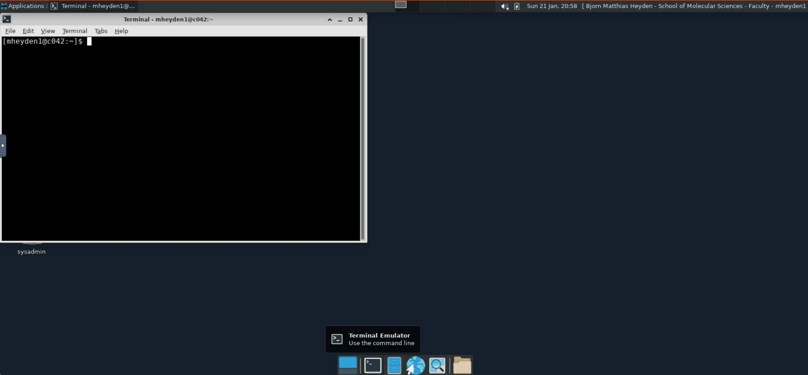
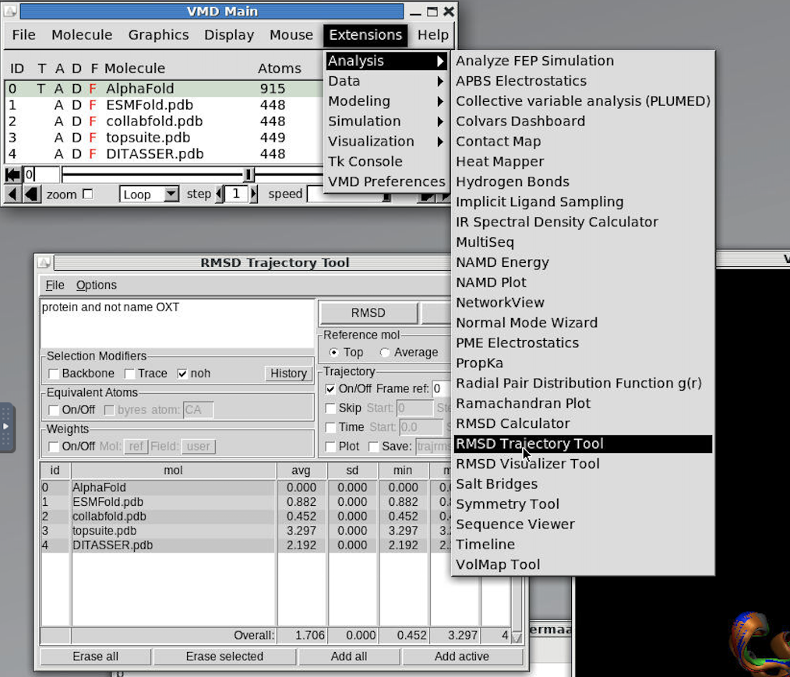
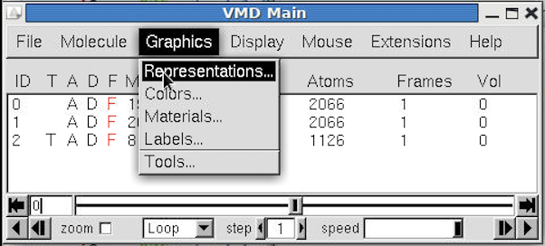
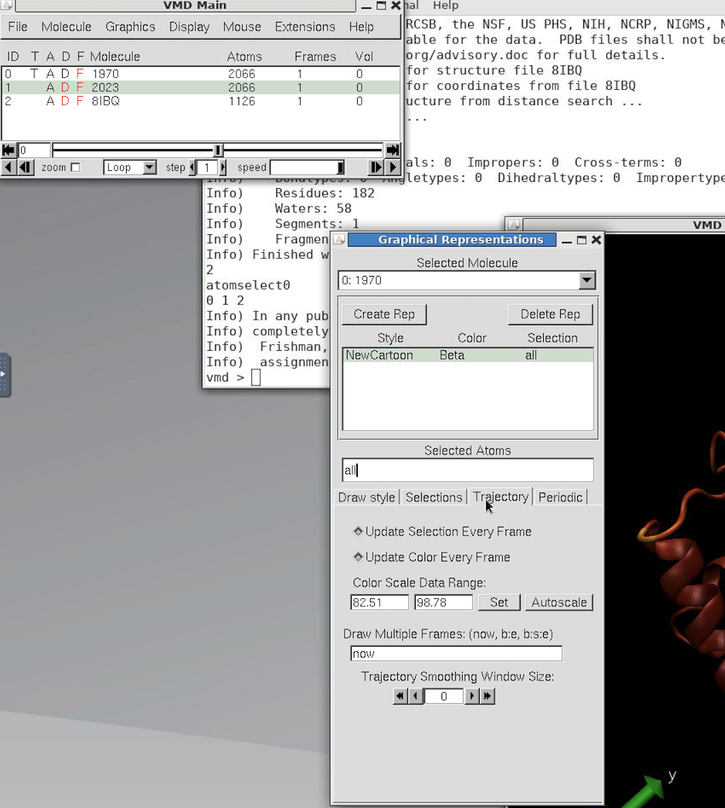
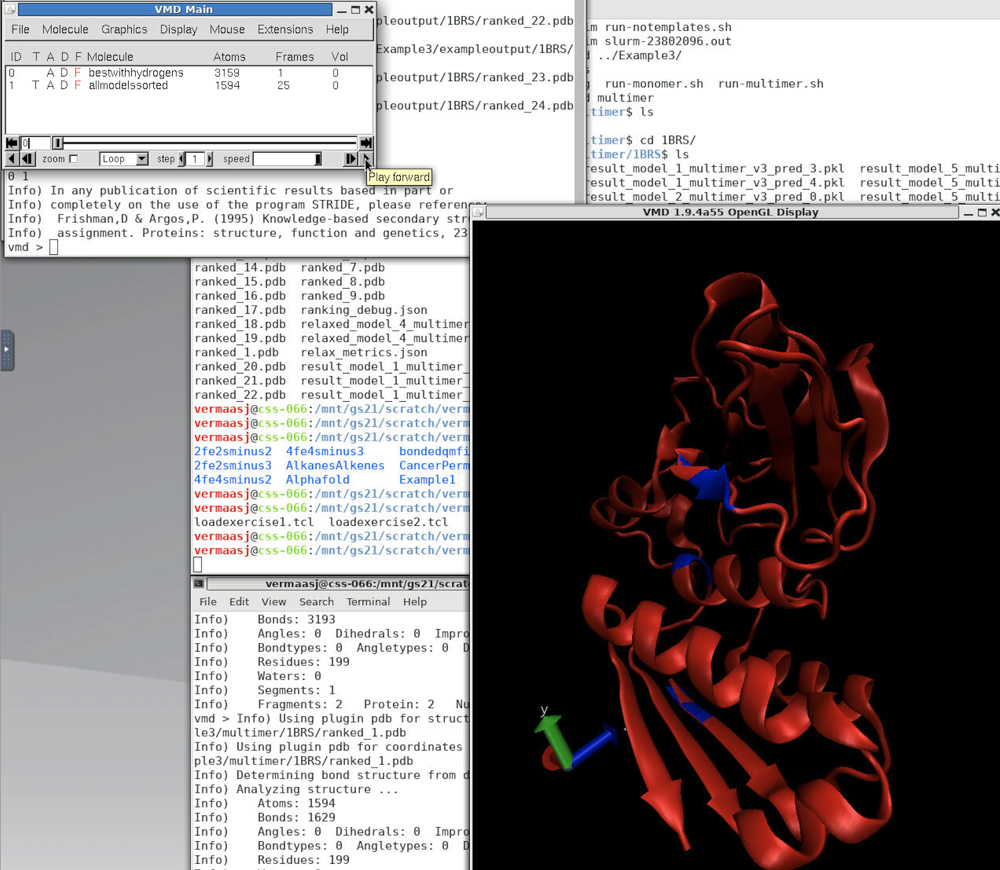

# Homework 4 Part 2 #
Special thanks to Josh Vermaas (Michigan State University) who prepared a previous version of this tutorial!

At this point, you will have predicted the structure of a small peptide with multiple webservers as well as AlphaFold2. Further, you will have performed structure predictions with AlphaFold2 with and without template information for another small proteins as well as for a protein complex. 

Now we will examine how similar the structure predictions for the peptide structure are. For this , we will use the program VMD (Visual Molecular Dynamics), which is already installed on SOL. This time we will need more than just a text-based interface, but the first step is to transfer the files with the webserver predictions to SOL.

First, create a folder/directory on your computer with the name `webserver-predictions`. Then copy the `.pdb` files with the predicted structures into that folder. For compatibility with the scripts you will use later, name the files as follows:

- ESMFold.pdb
- ColabFold.pdb
- topsuite.pdb
- DITASSER.pdb

I skipped RoseTTAFold here, because previous attempts indicated that the wait time for the RoseTTAFold prediction might be long to be practical for this exercise. 

Navigate to [sol.asu.edu](sol.asu.edu) in your browser and log in with your ASURITE ID. Then click on Files -> Home Directory as shown below. 


You will see the content of your `$HOME` directory on SOL. Navigate to the CHM501/HW4 directory. The folder should already contain the folders `Example-1`, `Example-2`, `Example-3` and `vmd-scripts`. 
Now click on the `Upload` button on the upper right of your window and drag and drop the `webserver-predictions` folder on your local computer into the upload field.

Next, click on `Interactive Apps` and select `Sol Desktop` as shown below.


On the next screen, you can select resources on one of the SOL nodes. The default settings are fine, but I recommend t adjust the time limit to ensure the session does not end after 1 hour. Your job will enter the "queue" but it should only take a short while until your session is available (status change from `queued` to `running`).  Once it is ready, click on `Launch Sol Desktop`.

Next you will see a very simple standard desktop screen similar to a Windows or MacOS computer. This interface allows us to open programs as `windows` with a graphical user interface. However, we will start (again) with a simple terminal, which you can open by clicking on the black'ish icon in the app list in center of the bottom of the screen.



First, we need to load the VMD module using the following terminal command:
```bash
module load vmd-1.9.3-gcc-11.2.0
```

## Comparing Structure Predictions ##

Now, we use the terminal to navigate to the `CHM501/HW4` folder. Next we need to load the `.pdb` files with the predictions into VMD and visualize them. 

For this, we can simply use a pre-prepared script that contains all necessary commands. We can also load the files "by hand" using VMD's graphical user interface and the mouse, but this is too tedious.

The script is located in your `VMDscripts` directory and we can inspect it by printing its content to the terminal.
```bash
cat VMDscripts/load-peptide.tcl
```

```TCL
mol new Example-1/exampleoutput/relaxed_model_3_pred_0.pdb
mol rename top AlphaFold
mol new webserver-predictions/ESMFold.pdb
mol new webserver-predictions/ColabFold.pdb
mol new webserver-predictions/DITASSER.pdb
mol new webserver-predictions/topsuite.pdb
mol top 0

set colorlist [list 0 1 3 7 6]
# AlphaFold = blue (0)
# ESMfold   = red (1)
# ColabFold = orange (3)
# DITASSER  = silver (6)
# topsuite  = green (7)
for { set i 0 } { $i < [molinfo num] } { incr i } {
    #This sets distinct colors for each prediction model
	mol modcolor 0 $i ColorID [lindex $colorlist $i]
    #This sets the 'Drawing Method' to NewCartoon which highlights secondary structure
	mol modstyle 0 $i NewCartoon 0.300000 10.000000 4.100000 0
}
menu main on
display resetview
```

Note, that if you used different names for the `.pdb` files or the directory, you will either need to modify the script or change the names according to the script.

To rename files or folders, use the `mv` terminal command. To edit the text files, use the `vi` or `emacs` command line text editors.

## Webserver output comparison ##

In terms of speed, ESMFold should have predicted a structure almost instantaneously, ColabFold within a minute or two, while the other webservers are considerably slower, ranging in response times between hours to days. Did you get a response from RoseTTAFold? If not, don't worry.

How do the results compare against each other?
How does AlphaFold do in [Example 1](Example-1), when it was predicting the structure for the same sequence?
We can answer all of those questions qualitatively and quantitatively using visualization and analysis tools such as VMD and the information encoded in the output files.

To use the `load-peptide.tcl` script to load all the files in VMD, type on the command line:
```bash
vmd -e VMDscripts/load-peptide.tcl
```

VMD will open and you should see two windows, the VMD Main window, which lists the loaded molecules, and the OpenGL display with the protein structures.

The script visualizes each protein based on its secondary structure and assigns different colors to each prediction (the comments in the script above tell you which one is which).

However, all structures look very different at first, because orientation of the predicted peptide structures in 3D space is random. 
To make a proper comparison, we need to rotate the proteins into a common orientation. 

Essentially, we need to rotate the proteins to make them look as similar as possible, so that any differences are associated with distinct structures and not position or rotation. 
The measurement of similarity that we use is the [root mean square deviation (RMSD)](https://en.wikipedia.org/wiki/Root-mean-square_deviation), which measures how different two structures are relative to each other. 

The easiest way to do that is with one of VMD's built-in analysis tool called `RMSD Trajectory Tool`. Click on `Extensions` on the top of the VMD Main window, then click `Analysis` and `RMSD Trajectory Tool`. 



The RMSD is an atom-wise measurement, however, the different protein structures have distinct numbers of atoms.
AlphaFold2 includes hydrogens, while the other tools do not. Further, the C-terminus is handled differently by the distinct prediction tools.
Therefore, we need to define a selection of atoms in each structure that is identical in each of them. 
We do this by replacing the default selection "*protein*" by "*protein and not name OXT*". 

Using the check boxes below, we can further select only backbone atoms ("backbone") or all non-hydrogen atoms within our selection ("noh"). Select one of them, then click on the "Align" button.

Now, you will see that the predicted structures are indeed very similar. 
One of them (the silver one for DITASSER), makes beta-sheets that VMD does not quite recognize as perfect. Consequently, the cartoon representation used here does not look the same as for the other proteins. 
However, the actual differences in the atomic positions are similar.

To measure how similar the structures are, click on the "RMSD" button. The first structure (the AlphaFold2 prediction) is used as the reference and the RMSD to itself is of course zero. 
How large are the RMSD's for the other structures (VMD measures the RMSD in Angstrom)?

## *INSTRUCTIONS FOR HOMEWORK SUBMISSION (1/4)* ##

Create a document with a screenshot of the aligned structures and their RMSD's. Perform the alignment and subsequence RMSD calculation both for backbone and non-hydrogen atoms and compare the results. Answer the following questions:
- Which RMSD (backbone or noh) is larger? 
- Can you explain why?
- Which of the webserver predictions is most similar to AlphaFold2?

## ##

Overall, we note that the RMSD's between the different predictions are not very large.
A crystal structure with a sub-3 Angstrom resolution is pretty good and most of the differences are smaller than that.

## What else can AlphaFold tell you? ##

At this point, we've taken a look at what the output structures look like, and have a bit of a sense that prediction methods will arrive at similar structures for well-behaved systems.
But there is more information in the AlphaFold output than just a structure.
The next step is to do a bit of digging into the directory structure AlphaFold generates, and take a look at the other output files generated by AlphaFold2.

The first one is `AF2-peptide.log`, which contains log messages that AlphaFold2 wrote while running the calculation.
Pay attention to the timestamps embedded into the log.
This tells you how long each step of the calculation took. We will see this in more detail later.

```bash
cd Example-1
#List the files
ls
#Notice how there is an "alphafold_output" directory that wasn't there before?
#It contains a directory called "peptide", because the file with the input sequence was called "peptide.fasta"
cd alphafold_output/peptide
ls
```

Each of the files in this directory can be printed to the terminal with `cat` as before (or opened with `vi` or `emacs`). 
The first file you can look at it is `timings.json`. 
This shows that the "features" calculation took the majority of the time (the times are measured in seconds), which is where AlphaFold is running the multiple sequence alignment.
Once you have the features, the prediction of structure models based off of those features is actually relatively fast.
This gives you an intuitive sense of why Meta and ColabFold targeted the feature generation in order to speed up structure predictions.

We'll be ignoring the files with the `.pkl` extension.
These are python "pickle" files, and are basically machine-readable data structures that you can use to plot quality metrics in higher precision.
Scripts for analyzing these files can be found online, like [this script from Belgium](https://github.com/jasperzuallaert/VIBFold/blob/main/visualize_alphafold_results.py) that will plot pLDDT or pae (predicted alignment error) from these pickles, or [this script](https://blog.biostrand.be/explained-how-to-plot-the-prediction-quality-metrics-with-alphafold2).

### pLDDT scores and model quality

Another noteworthy file is `ranking_debug.json`. AlphaFold is making multiple models.
It ranks them by the pLDDT score, which is a metric that calculates how plausible a structure is.
The higher the score, the more plausible the structure.
Its origins come from this [2013 paper](https://doi.org/10.1093/bioinformatics/btt473), which talks about some of the shortcomings for using RMSD as the primary structural metric when assessing model quality.

Here is how the AlphaFold authors think about how to use pLDDT scores to assess model quality, lifted from their [FAQ](https://alphafold.ebi.ac.uk/faq):

AlphaFold produces a per-residue estimate of its confidence on a scale from 0 - 100. This confidence measure, pLDDT, corresponds to the model’s predicted score on the lDDT-Cα metric. It is stored in the B-factor fields of the mmCIF and PDB files available for download (although unlike a B-factor, higher pLDDT means a better defined structure). 

pLDDT can also be used to color-code the residues in the 3D structure of the model. We will do this later. The following rules of thumb provide guidance on the expected reliability of a given region:

- Regions with pLDDT > 90 are expected to be modelled to high accuracy. These should be suitable for any application that benefits from high accuracy (e.g. characterizing binding sites).
- Regions with pLDDT between 70 and 90 are expected to be modelled well (a generally good backbone prediction).
- Regions with pLDDT between 50 and 70 are low confidence and should be treated with caution.
- The 3D coordinates of regions with pLDDT < 50 often have a ribbon-like appearance and should not be interpreted. A [pLDDT < 50 is a reasonably strong predictor of disorder](https://doi.org/10.1038/s41586-021-03819-2), i.e., it suggests such a region is either unstructured in physiological conditions or only structured as part of a complex. (Note: this relationship has typically been tested in the context of well-studied proteins, which may have more evolutionarily-related sequences available than a randomly chosen UniProt entry.)
- Structured domains with many inter-residue contacts are likely to be more reliable than extended linkers or isolated long helices.
- Unphysical bond lengths and clashes do not usually appear in confident regions. Any part of a structure with several of these should be disregarded.

Note that the PDB and mmCIF files contain coordinates for all regions, regardless of their pLDDT score. It is up to the user to interpret the model judiciously in accordance with the guidance above.

We'll be taking a closer look at the pLDDT scores when analyzing Example-2.

### Origins of the AlphaFold templates ###

If we dig a little deeper in the AlphaFold output, there is also a `msas` directory, which holds the multiple sequence alignments used to do templating.
If we look in the directory in the usual way from the terminal:

```bash
cd msas
ls
```

There are typically four files in there, `mgnify_hits.sto`, `pdb_hits.hhr`,   `small_bfd_hits.sto`, and `uniref90_hits.sto`.
These files are all human readable, if in a super-structured format, so you can open these files in `gedit` as well.
The `.sto` file extension is known in bioinformatics contexts as a [Stockholm format](https://en.wikipedia.org/wiki/Stockholm_format) file, which can hold multiple sequence alignments.
The purpose of the sequence alignments is to build the co-variance matricies that help AI determine what residues co-vary with one another, and thus are close in space.
By lining up multiple sequences and seeing what varies and what does not, AlphaFold can learn something about what the protein structures should be, even if no templates are provided.

However, AlphaFold also uses existing overlap with sequences found in the PDB to help determine the structure.
The `pdb_hits.hhr` is highly informative as it provides the PDB code of structures with high seqience similarity.
For instance, the top hits for the peptide sequence are [6BGN](https://www.rcsb.org/structure/6bgn), a tautomerase, [2OP8](https://www.rcsb.org/structure/2OP8), another tautomerase that crystalized as a multimer.
This tells me that this test peptide is probably a tautomerase itself, and that the biological assembly is probably not monomeric.

## Structural quality visualization ##

To this point, we've mostly been looking at text files.
But the details encoded into the text files can also be shown visually.
The pLDDT scores in particular are encoded into the output `.pdb` files in the `beta` column, which is the column right after the coordinates and the `occupancy` column in the file.
The key is that visualization programs like VMD can readily use this information to assign color to their renderings, providing instant feedback.

In Example-2, we calculated the same structure with two different settings for the `max_template_date` parameter, which limits which PDB structures are used as potential templates.
The 2022 date in `run-full.sh` allows AlphaFold2 to use all PDB structures published before 2022 as a template for the structure of the [protein](https://www.rcsb.org/structure/8IBQ) that we aimed to predict (which was solved more recently)
The 1970 date in `run-notemplates.sh` effectively means that AlphaFold2 is *only* allowed to rely on sequence alignment data and its neural network training to determine the structure.
We can double-check this with `grep` command and search for a specific sentence in the log files.

```bash
cd ~/CHM501/HW4/Example-2
grep "Total number of templates" *.log
```

Indeed, the `AF2-notemplates.log` file reports that no templates were in the pipeline, in contrast to the `AF2-full.log` file.
We'll be using our results from this test case to look at how different the predicted structure are based on this difference. 
For this purpose, we have another VMD script to load the structures automatically.

```bash
cd ..
#just in case your are using a new terminal
module load vmd-1.9.3-gcc-11.2.0
vmd -e VMDscripts/load-comparison.tcl
```

VMD should open with two windows as usual. Three distinct structures will be loaded:
- the recently solved experimental structure 8IBQ (silver)
- the structure predicted with templates (red)
- the structure predicted wihtout templates (blue)

How different are these structures? Visually, there are clearly pretty similar.
The RMSDs would be expected to be small, and that is what we see if we use the `RMSD trajectory tool` again. 
In this case, we need to define the selection as "protein and not altloc B". 
This particular experimental structure has a few residues for which multiple conformations are observed, encoded as "alternate locations" (altloc).
Further, we cannot use the default `noh` selection, and instead need to use `backbone` as the selection modifier.
There are some missing heavy atoms in the experimental structure, so the number of atoms does not match between our AlphaFold models and the experimental structure.

## *INSTRUCTIONS FOR HOMEWORK SUBMISSION (2/4)* ##

- Provide a snapshot of the superimposed predicted and experimental structures.
- Determine the backbone RMSD (after alignment) between both predicted structures and the experimental structure and between the two predicted structures (3 RMSDs)
- The experimental resolution (measure of uncertainty) of the experimental structure is 1.45 A. Are the predicted structures distinguishable from the experimental structure?

## ##

The question is now how confident AlphaFold2 is in its prediction in each case. 
To visualize this, we open the `Graphical Representations` window (under `Graphics->Representations`) and color a selected structure by `beta`.
To make this clearer, you can hide molecules you aren't interested in by double clicking on the black "D" in the VMD main window (D=display in this case).
Once it turns red, you will hide that molecule from view until you double click the D again to bring it back.



Within the graphical representations window, we can select the molecule we are editing the selection for on the top of the window from the drop-down box.
Then change the coloring method to from `ColorID` to `beta`, which uses the maximum and minimum beta values encoded in the structure to color the protein, i.e., the pLDDT scores.
If we click on the `Trajectory` tab of the `Graphical Representations` window, we find the `Color Scale Data Range`, which shows you the minimum and maximum values for the `beta` column (the pLDDT score). You can also change them for each molecule to allow for better comparisons, i.e., set the lowest value to 50 fand the highest to 100.

The default color scale runs from red (low values) to white to blue (high values).



## *INSTRUCTIONS FOR HOMEWORK SUBMISSION (3/4)* ##

Answer the following questions:
- How different are the pLDDT scores for the predictions with (max_template_date=2022) and without (max_template_date=1970) templates?
- How important is structural homology/good templates for predicting an accurate structure?
- Where are the pLDDT scores the lowest in the structure? What is special about these parts of the protein?

## ##

## Variability in AlphaFold models

So far, we've been taking pains to only load in the single-best model that AlphaFold generated.
But at least on the default settings, AlphaFold will output multiple different potential structures.
Sometimes, these are pretty similar, particularly for single domain proteins.
But for protein complexes, sometimes AlphaFold will generate multiple conformations, and it is up to the user to determine which conformation makes the most sense.

We will investigate this for the Barnase-Barstar protein complex, for which we ran the structure prediction in Example-3. 
Again, we are using a script to automatically load the predicted structures.

```bash
cd ~/CHM501/HW4/Example-3
#just in case your are using a new terminal
module load vmd-1.9.3-gcc-11.2.0
vmd -e VMDscripts/load-complex.tcl
```

That will bring up a screen that looks something like what is shown below.
Note that if you click in the lower right of the VMD main window, you can animate through the 25 different structures for the Barnase-Barstar complex that AlphaFold2 generated.
How consistent are the 25 different structures for the complex?

Here is an instance where we can quantify that through the RMSD trajectory tool again.
Choose the backbone and click on the "Plot" check box before clicking on the "RMSD" button. This will generate a plot of the RMSD as a function of the model index. 



## *INSTRUCTIONS FOR HOMEWORK SUBMISSION (4/4)* ##

Answer the following questions:
- Prepare a snapshot of the RMSD vs. model index grpah
- Which frame has the largest RMSD with respect to the reference (best prediction)?
- Prepare a snapshot in which you show the structures of the refernce (best prediction) and the structure with the largest RMSD amond the 25 models

## ##


Now, it is not always sunshine and rainbows as it is here, where all structures are essentially identical. 
The complex for which we predicted the structure is one with the strongest protein-protein interactions known. Predicting the structure of protein complexes becomes substantially more difficult for complex with weak interactions (dissociation constants in micro- to millimolar range compared to femtomolar for Barnase-Barstar). However, you now have the tools you need to predict such structures and to evaluate the model confidence.

## Wrapping up

At this point, you hopefully have a flavor for what can be done with AlphaFold2 and similar artificial intelligence tools for protein structure prediction.
They can clearly predict protein structure, and often reasonably well.
However, in cases where the methods are asked to predict something far outside of their training data, they can struggle.
But, given how *cheap* it is to run AlphaFold and similar methods, it never hurts to take a look what kinds of hypotheses you can generate based on their predictions.